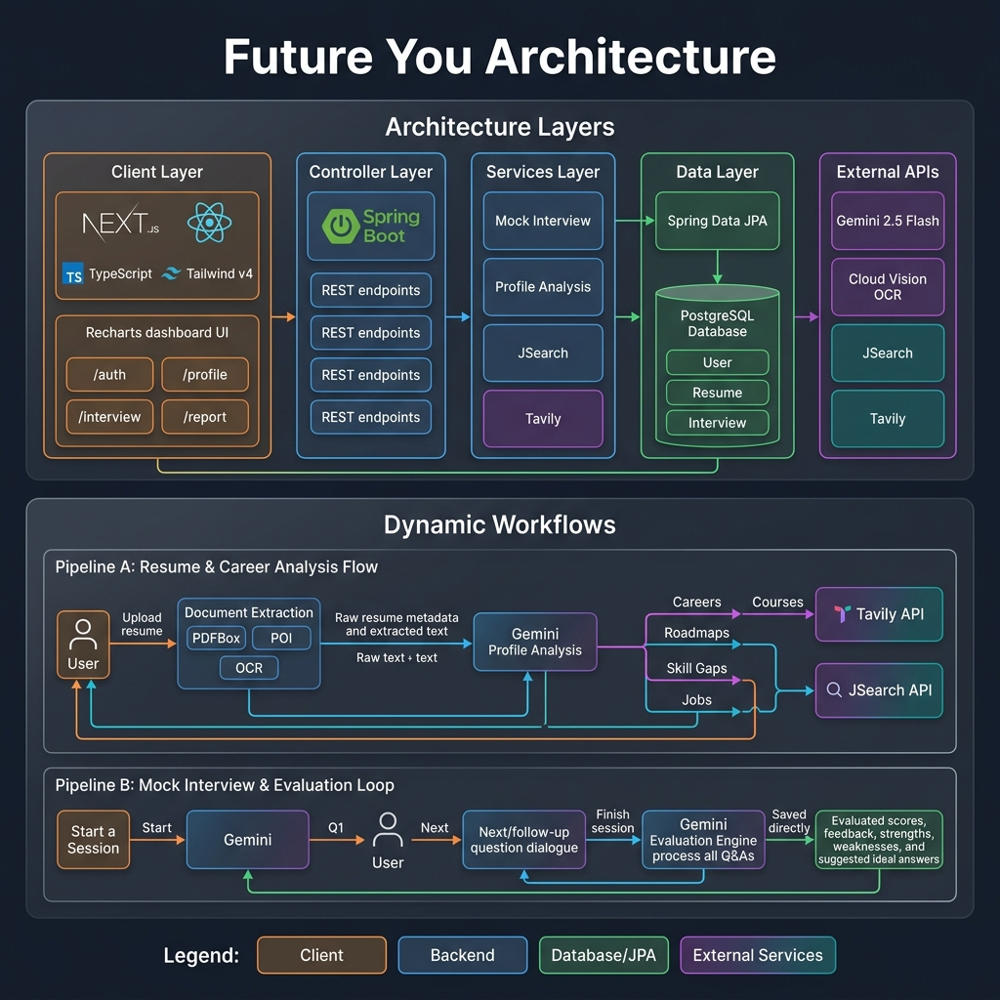

# FutureYou — AI-Powered Career Guidance & Mock Interview Platform

FutureYou is a full-stack platform designed to help professionals and students analyze their profiles, discover customized career roadmaps, bridge skill gaps with training resources, explore job openings, and practice interactive mock interviews evaluated by advanced AI.

---

## 🗺️ System Architecture & AI Pipelines

Below is the technical architecture and data flow diagram for FutureYou, illustrating how the client, backend controllers, Spring Data JPA entities, and external API gateways integrate:



---

## ✨ Core Features

### 📂 1. Document Extraction Pipeline
* **Multi-Format Support**: Upload resumes in **PDF**, **DOCX**, or **Image** formats (PNG/JPG).
* **Smart Parsing**: 
  * PDFs parsed via **Apache PDFBox**.
  * DOCX parsed via **Apache POI**.
  * Image uploads processed via OCR using the **Google Cloud Vision API**.
* **Persistence**: Extracted resume text and file metadata are saved directly to the database for subsequent profile reviews.

### 🧠 2. AI Profile Analysis & Career Roadmap (On-Demand)
* **Domain Recognition**: Automatic categorization of candidate experience.
* **Roadmap Generation**: Custom career suggestions generated by **Gemini 2.5 Flash** mapping out potential career paths.
* **Skill Gap Analysis**: Pinpoints the missing competencies needed to transition to recommended career paths.

### 📚 3. Live Resource & Job Fetching (On-Demand)
* **Course Recommendations**: Integrates with the **Tavily Search API** to fetch real-world online training courses to bridge identified skill gaps.
* **Job Opportunities**: Employs the **JSearch API** (via RapidAPI) to retrieve active job postings tailored by role type and target region (MY, SG, US, GB).

### 💬 4. Interactive AI Mock Interview & Evaluation
* **First Questioning**: Generates custom technical and behavioral questions based on target roles and parsed resume histories.
* **Dynamic Dialogue Loop**: A smart follow-up logic engine determines whether to dig deeper into candidate answers or progress to new questions.
* **Comprehensive Evaluation**:
  * Calculates **Overall, Professional Knowledge, and Communication Scores** (0-100 scales).
  * Lists tailored **Strengths** & **Weaknesses**.
  * Generates a **Question Review** mapping candidate answers, custom feedback, and an **ideal suggested answer** for each question.
* **Report Archiving**: All evaluations and reviews are persisted to PostgreSQL to allow review histories.

---

## 🛠️ Technology Stack

### Frontend (Client Layer)
* **Core**: Next.js (App Router), React 19, TypeScript
* **Styling**: Tailwind CSS v4, Radix UI Primitives, Lucide Icons
* **Data Visualization**: Recharts (rendered on evaluation reports)

### Backend (Application & Database Layer)
* **Framework**: Spring Boot (Java 17 REST APIs)
* **ORM**: Spring Data JPA
* **Database**: PostgreSQL (Relational storage for Users, Resumes, Interviews, and Question Reviews)

### External API integrations
* **Google Gemini API** (`gemini-2.5-flash` model for chat, profile analysis, and mock evaluation)
* **Google Cloud Vision API** (OCR processing)
* **JSearch API** (RapidAPI for live job listings)
* **Tavily Search API** (online course search queries)

---

## 🚀 Getting Started

### Prerequisites
* **Java 17 JDK** or higher
* **Node.js** (v18+) & **pnpm** (preferred) or **npm**
* **PostgreSQL Database**

---

### 📦 1. Backend Setup

1. Navigate to the `backend` directory.
2. Create an `.env` file (copied from `.env.example`) or configure your system variables with the following properties:
   ```env
   # PostgreSQL configuration
   spring.datasource.url=jdbc:postgresql://localhost:5432/future_you
   spring.datasource.username=your_db_username
   spring.datasource.password=your_db_password

   # External API Keys
   gemini.api.key=your_google_gemini_api_key
   jsearch.api.key=your_rapidapi_jsearch_key
   tavily.api.key=your_tavily_api_key
   ```
3. Run the Spring Boot application:
   ```bash
   # Using the Maven Wrapper
   ./mvnw spring-boot:run
   ```

---

### 💻 2. Frontend Setup

1. Navigate to the `frontend` directory.
2. Install dependencies:
   ```bash
   pnpm install
   # or
   npm install
   ```
3. Run the Next.js development server:
   ```bash
   pnpm dev
   # or
   npm run dev
   ```
4. Open [http://localhost:3000](http://localhost:3000) in your browser.